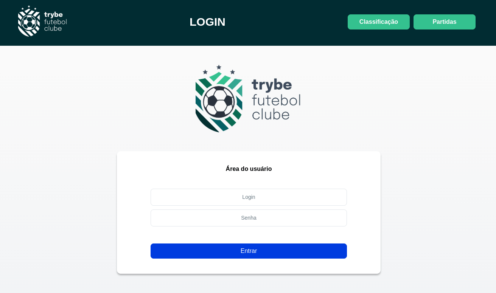

# Projeto Trybe Futebol Clube

> Status do projeto: Concluído :heavy_check_mark:


Trybe Futebol Clube foi o 27° projeto realizado durante a formação da Trybe. Esse projeto pertence a seção 10 do Modulo de Back-end e foi desenvolvido em novembro de 2022.

## Descrição do projeto

Um site informativo sobre partidas e classificações de futebol. O front-end estava pronto sendo necessario desenvolver apenas o back-end.

Tecnologias utilizadas:

- Typescript para construir a API utilizando Programação Orientada a Objeto;
- Modelagem de dados com MySQL através do sequelize;
- JWT para autenticação dos usuários;
- Bcryptjs para criptografar as senhas dos bancos de dados
- Mocha, Chai e Sinon na realização dos testes.



## Como rodar

- Clone o repositório 
```
git@github.com:GusCabraal/trybe-futebol-clube.git
```
- Instale as dependencias 
```
npm install
```
- Rode o script `npm run compose:up:dev`, esse script subirá o front-end na porta `3000`, o back-end na porta `3001` e o banco de dados na porta `3002`;
- Acesse o front end no localmente no endereço 
```
http://localhost:3000
```
- Ou se preferir consumir apenas o back-end: Importe o arquivo `routes-project-trybe-futebol-clube.json` para dentro do Insominia
- Consuma a API sem moderação.


## Testes
Foram realizados testes de integração em todas as rotas da aplicação. Para rodar os testes entre no diretório do back-end `cd app/backend`


<details>
<summary><strong> Rodando os testes </strong></summary><br />

- Execute o comando:
 ```
 npm test
 ```


</details>

<details>
<summary><strong>Para rodar os testes de cobertura</strong></summary><br />

- Execute a cobertura de testes:
 ```
 npm run test:coverage
 ```


</details>

## Tabelas 

- Usuarios

| campo | tipo | regra |
|-------|------|-----------|
| id | number | primary key|
| username | email | |
| role | string | |
| password | string | |


- Times

| campo | tipo | regra |
|-------|------|-----------|
| id | number | primary key|
| teamName | email | |

- Partidas

| campo | tipo | regra |
|-------|------|-----------|
| id | number | primary key|
| homeTeam | number | Chave estrangeira da tabela Times(id) |
| homeTeamGoals | number |  |
| awayTeam | number | Chave estrangeira da tabela Times(id) |
| awayTeamGoals | number |  |


## Rotas

### Rotas de usuário

- POST `/login` -> Faz o login na aplicação;
- POST `/login/validate` -> Retorna a função do usuario logado;

### Rotas de times

- GET `/teams` -> Lista todos os times;
- GET `/teams/:id` -> Busca um time pelo seu ID;

### Rotas de partidas

- GET `/matches` -> Lista todas as partidas;
- GET `/matches?inProgress=status` -> Filtra as partidas por `em progresso` e `finalizadas`;
- POST `/matches` -> Cadastra uma nova partida;
- PATCH `/matches/:id` -> Finaliza uma partida em andamento;

### Rotas de classificação

- GET `/leaderboard` -> Retorna a tabela de classificação completa;
- GET `/leaderboard/home` -> Retorna a tabela de classificação apenas dos times mandantes;
- GET `/leaderboard/away` -> Retorna a tabela de classificação apenas dos times visitantes;